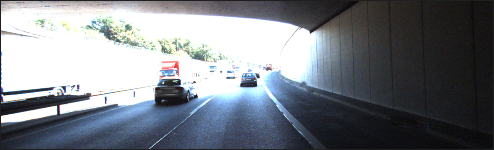

# KITTI Dataset Processing and YOLOv5 Object Detection

## Overview
This repository presents a complete and systematic pipeline for processing the KITTI dataset, training a YOLOv5 object detection model, and deploying the trained model for real-time inference. The methodology covers dataset preparation, model training, format conversion, and practical applications. The implementation is optimized for execution in a Google Colab environment.

---

## Table of Contents
1. [Introduction](#introduction)
2. [Dataset Preparation](#dataset-preparation)
    - Downloading the KITTI Dataset
    - Converting KITTI Labels to YOLO Format
    - Organizing the Dataset
3. [Model Training](#model-training)
4. [Model Conversion](#model-conversion)
5. [Inference and Object Detection](#inference-and-object-detection)
6. [Practical Applications](#practical-applications)
7. [Conclusion](#conclusion)

---

## Introduction
The KITTI dataset is a widely utilized benchmark dataset in autonomous driving research. It provides annotated images for various tasks, including object detection and tracking. This project employs the YOLOv5 model, an advanced real-time object detection algorithm, to detect objects in the KITTI dataset and provide actionable insights.

### Key Features:
- **Dataset Preparation**: Conversion of KITTI labels to the YOLOv5 format.
- **Model Training**: YOLOv5 model training on the KITTI dataset.
- **Model Conversion**: Deployment-ready conversion to TensorFlow Lite.
- **Inference & Object Detection**: Real-time object detection and movement recommendations.

---

## Dataset Preparation
### Step 1: Download the KITTI Dataset
The dataset is fetched using the Kaggle API.

```bash
!kaggle datasets download -d klemenko/kitti-dataset
!unzip kitti-dataset.zip -d /content/kitti-dataset
```

### Step 2: Convert KITTI Labels to YOLO Format
KITTI labels are converted into YOLO format to ensure compatibility with YOLOv5 training.

```python
import os

def convert_kitti_to_yolo(kitti_label_path, yolo_label_path, image_width, image_height):
    with open(kitti_label_path, 'r') as f:
        lines = f.readlines()
    
    yolo_labels = []
    for line in lines:
        parts = line.strip().split()
        class_name = parts[0]
        if class_name not in ['Car', 'Pedestrian']:
            continue
        
        class_id = 0 if class_name == 'Car' else 1
        xmin, ymin, xmax, ymax = map(float, parts[4:8])
        x_center = (xmin + xmax) / 2 / image_width
        y_center = (ymin + ymax) / 2 / image_height
        width = (xmax - xmin) / image_width
        height = (ymax - ymin) / image_height
        
        yolo_labels.append(f"{class_id} {x_center} {y_center} {width} {height}\n")
    
    with open(yolo_label_path, 'w') as f:
        f.writelines(yolo_labels)
```

### Step 3: Organizing the Dataset

```python
import random

# Split images into train and validation sets
all_images = os.listdir("/content/kitti-yolo/images/train")
random.shuffle(all_images)
split_idx = int(0.8 * len(all_images))
train_images, val_images = all_images[:split_idx], all_images[split_idx:]

for image in val_images:
    os.rename(f"/content/kitti-yolo/images/train/{image}", f"/content/kitti-yolo/images/val/{image}")
    label = image.replace('.png', '.txt')
    os.rename(f"/content/kitti-yolo/labels/train/{label}", f"/content/kitti-yolo/labels/val/{label}")
```

---

## Model Training
### Step 1: Train the YOLOv5 Model

```bash
!python train.py --img 640 --batch 16 --epochs 50 --data /content/kitti-dataset/kitti.yaml --weights yolov5s.pt
```

### Step 2: Export the Trained Model to ONNX Format

```bash
!python export.py --weights runs/train/exp/weights/best.pt --img 640 --batch 1 --include onnx
```

---

## Model Conversion
### Step 1: Convert ONNX Model to TensorFlow Frozen Graph

```python
import onnx
from onnx_tf.backend import prepare

onnx_model = onnx.load("runs/train/exp/weights/best.onnx")
tf_rep = prepare(onnx_model)
tf_rep.export_graph("tflite_graph.pb")
```

### Step 2: Convert Frozen Graph to TensorFlow Lite Format

```python
import tensorflow as tf

converter = tf.compat.v1.lite.TFLiteConverter.from_frozen_graph(
    graph_def_file="tflite_graph.pb",
    input_arrays=["images"],
    output_arrays=["output"],
    input_shapes={"images": [1, 640, 640, 3]}
)
converter.allow_custom_ops = True
tflite_model = converter.convert()

with open("model_postprocessed.tflite", "wb") as f:
    f.write(tflite_model)
```

---

## Inference and Object Detection
### Step 1: Load the Trained YOLOv5 Model

```python
import torch
model = torch.hub.load('ultralytics/yolov5', 'yolov5s')
```

### Step 2: Perform Object Detection

```python
from PIL import Image

def detect_objects(test_images_path, img_width):
    test_images = os.listdir(test_images_path)
    
    for img_name in test_images:
        img_path = os.path.join(test_images_path, img_name)
        img = Image.open(img_path)
        results = model(img)
        detections = results.pandas().xyxy[0]
        
        move_direction = "SAFE TO MOVE FORWARD"
        for _, row in detections.iterrows():
            x_min, x_max = row["xmin"], row["xmax"]
            obj_center = (x_min + x_max) / 2
            if obj_center < img_width / 3:
                move_direction = "MOVE RIGHT"
            elif obj_center > 2 * img_width / 3:
                move_direction = "MOVE LEFT"
            else:
                move_direction = "STOP"
        
        print(f"🔹 Processing: {img_name}")
        print(f"➡ Recommended Move: {move_direction}")
```

---

#  Object Detection and Navigation Pipeline  

A structured visualization of the image processing workflow, demonstrating input frames, obstacle detection,and steering decisions.

---

## 1️⃣ Input Images  
**Raw images used for analysis.**  

<p align="center">
  
  
  
   
</p>

---

## 2️⃣ Obstacle Detection  
**Object detection using YOLOv5.**  

<p align="center">
  
  
  
  
</p>

---

## 3️⃣ Steering Directions  
**Decision-making for navigation.**  

<p align="center">
  
  
  
    
</p>

---

This structured visualization provides a clear breakdown of the navigation process. 🚗 

## Practical Applications
- **Autonomous Vehicles**: Real-time obstacle detection and navigation.
- **Surveillance Systems**: Advanced object detection and tracking.
- **Robotics**: Enhanced environment interaction capabilities.

---

## Conclusion
This project delivers a full-stack implementation for processing the KITTI dataset, training a YOLOv5 model, and deploying it for real-time object detection. 
The trained model can be exported to TensorFlow Lite for edge-device applications, ensuring adaptability and scalability. 
The modular design allows for seamless extension to other datasets and tasks.

---

**Contributors:** Aryan   
**Contact:** aryan.231cs213@nitk.edu.in
